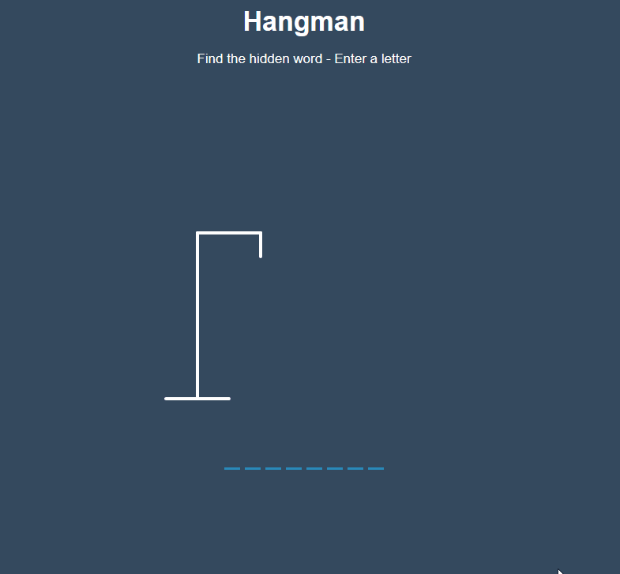

# Hangman Game  
- Simple hangman game that uses HTML/CSS and vanilla JS. 
- The words are generated randomly from a store of words pulled from here: https://github.com/words/an-array-of-english-words
    - FYI, some words may be inappropriate.
- An async function grabs the json from the `words.json` file, parses it and randomly selects a word from the array.
- Bonus functionality:
    - Allowing "Enter" keypress on modal popup to Play Again.

## Instructions/How-to-Play
- Simply start guessing letters by typing them into your keyboard
- Win state: Guessing the word within 5 guess
- Lose State: Six wrong letter guesses.
- Cheat: the generated word is stored as a global variable. If you console log that variable by name you will have the answer. 

## Project Preview

[LIVE DEMO](https://kelenam.github.io/hangman-game/)

## How to Install
- `git clone` this repo
- No hard dependencies required to run so no need for `npm/yarn` installs. 
- Just open the `index.html` file or use server of your choice.
- Note: If modifying the file, and you have TS already installed, you can just call `tsc --watch` in the root project directory to compile your js into appropriate dir.
- I'd recommend using the VSCode Sass Plugin as well.  

## TODO
- Disallow key input / "playing" of game after win/lose by setting a game state. 
- Deal with UX regarding speed of input. If you mash abunch of letters very quickly it can be 
- Mobile support.
- Add local storage to keep score of wins/loses. 

## Project Notes
```js 
let x = [1,2,3];
console.log(Math.floor(Math.random() * x.length));
// --> random number from 0-2 

console.log(Math.ceil(Math.random() * x.length));
// --> random number from 1-3
```
In the code above, remember `floor` is rounding down the randomly produced product of a floating point number between 0-0.9999bar ((inclusive of 0, but not 1) and the length of the given array, 3.

- For my word list I just copied the array foudn in index.json from https://github.com/words/an-array-of-english-words

- I was running into an issue with my stick figure not appropriately drawing on the third figure-part, it turns out I had an extra figure body line... Took me way too long to troubleshoot that. I event length checked the figure-part length and was like yup, length of 7, sounds right... So silly.
 